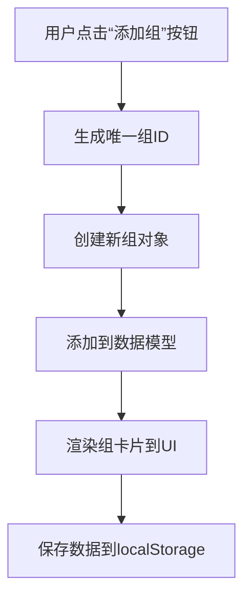
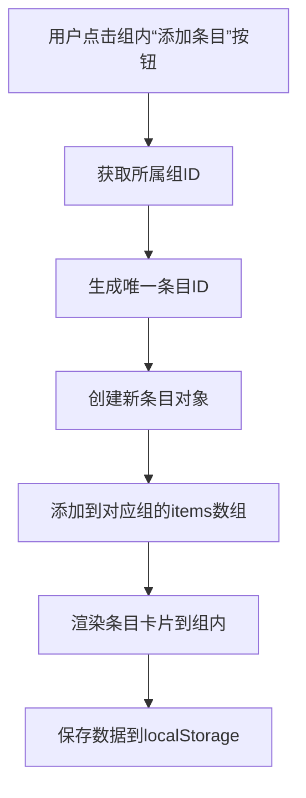
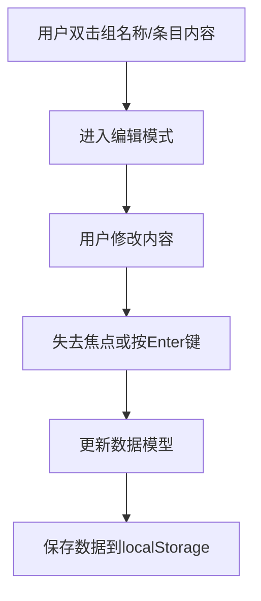
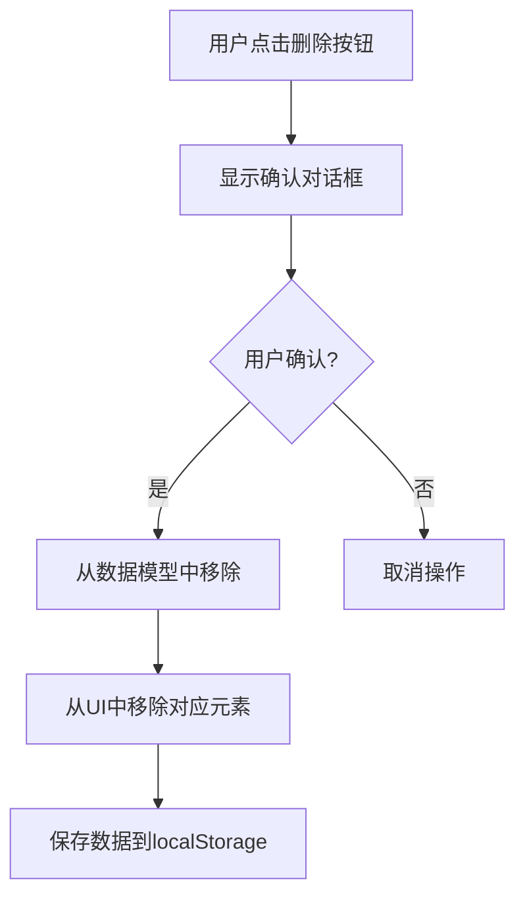
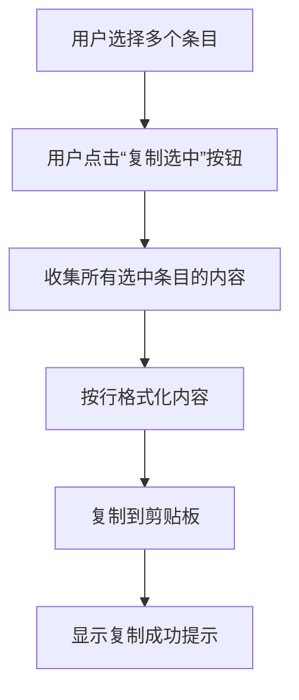
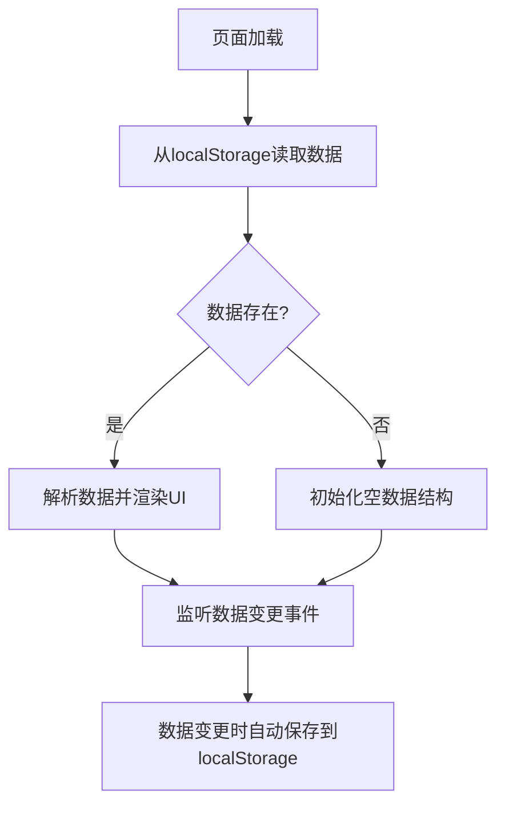

# 层级化条目管理系统 - 架构设计文档

## 1. 项目概述

本项目是一个层级化的条目管理系统，采用卡片式布局，支持组和条目的增删改查、条目选择、批量复制等功能，并使用localStorage进行数据持久化。

## 2. 项目文件结构

```
BigToDoList/
├── index.html              # 主页面入口
├── css/
│   ├── style.css          # 主样式文件
│   ├── reset.css          # CSS重置
│   └── responsive.css     # 响应式设计样式
├── js/
│   ├── app.js             # 主应用逻辑
│   ├── dataManager.js     # 数据管理模块
│   ├── uiManager.js       # UI管理模块
│   └── utils.js           # 工具函数
└── assets/
    └── images/            # 图片资源（如有需要）
```

## 3. 数据模型设计

### 3.1 整体数据结构

```javascript
{
  groups: [
    {
      id: "group_1",           // 组唯一标识
      name: "组名称",           // 组名称
      items: [
        {
          id: "item_1",        // 条目唯一标识
          content: "条目内容",  // 条目文本内容
          checked: false       // 是否选中
        }
      ]
    }
  ]
}
```

### 3.2 数据模型说明

#### Group（组）对象
- `id`: 组的唯一标识符，使用UUID或时间戳生成
- `name`: 组的名称，用户可编辑
- `items`: 属于该组的条目数组

#### Item（条目）对象
- `id`: 条目的唯一标识符，使用UUID或时间戳生成
- `content`: 条目的文本内容，用户可编辑
- `checked`: 条目的选中状态，用于批量操作

### 3.3 数据持久化策略

- 使用`localStorage`存储完整数据结构
- 数据键名：`hierarchical_item_manager_data`
- 数据更新时机：每次数据变更后自动保存
- 数据加载时机：页面初始化时自动加载

## 4. 用户界面布局设计

### 4.1 整体布局结构

```html
<!DOCTYPE html>
<html lang="zh-CN">
<head>
  <meta charset="UTF-8">
  <meta name="viewport" content="width=device-width, initial-scale=1.0">
  <title>层级化条目管理系统</title>
  <link rel="stylesheet" href="css/reset.css">
  <link rel="stylesheet" href="css/style.css">
  <link rel="stylesheet" href="css/responsive.css">
</head>
<body>
  <header class="app-header">
    <h1>层级化条目管理系统</h1>
    <div class="header-actions">
      <button id="add-group-btn" class="btn btn-primary">添加组</button>
      <button id="copy-selected-btn" class="btn btn-secondary">复制选中</button>
    </div>
  </header>

  <main class="app-main">
    <section id="groups-container" class="groups-container">
      <!-- 组卡片将动态插入这里 -->
    </section>
  </main>

  <footer class="app-footer">
    <p>&copy; 2023 层级化条目管理系统</p>
  </footer>

  <script src="js/utils.js"></script>
  <script src="js/dataManager.js"></script>
  <script src="js/uiManager.js"></script>
  <script src="js/app.js"></script>
</body>
</html>
```

### 4.2 组卡片UI设计

```html
<div class="group-card" data-group-id="group_1">
  <div class="group-header">
    <h2 class="group-name" contenteditable="true">组名称</h2>
    <div class="group-actions">
      <button class="btn-icon add-item-btn" title="添加条目">+</button>
      <button class="btn-icon delete-group-btn" title="删除组">×</button>
    </div>
  </div>
  <div class="group-items">
    <!-- 条目卡片将动态插入这里 -->
  </div>
</div>
```

### 4.3 条目卡片UI设计

```html
<div class="item-card" data-item-id="item_1">
  <input type="checkbox" class="item-checkbox">
  <div class="item-content" contenteditable="true">条目内容</div>
  <button class="btn-icon delete-item-btn" title="删除条目">×</button>
</div>
```

### 4.4 响应式设计

- **桌面端**：多列网格布局，组卡片并排显示
- **平板端**：双列网格布局
- **移动端**：单列布局，组卡片垂直堆叠

## 5. 核心功能流程图

### 5.1 添加组流程



### 5.2 添加条目流程



### 5.3 编辑组名称/条目内容流程



### 5.4 删除组/条目流程



### 5.5 批量复制选中条目流程



### 5.6 数据持久化流程



## 6. 模块化设计

### 6.1 数据管理模块 (dataManager.js)

负责数据的CRUD操作和持久化：

```javascript
class DataManager {
  constructor() {
    this.data = this.loadData();
  }

  // 加载数据
  loadData() { /* ... */ }

  // 保存数据
  saveData() { /* ... */ }

  // 组操作
  addGroup(name) { /* ... */ }
  updateGroup(id, name) { /* ... */ }
  deleteGroup(id) { /* ... */ }

  // 条目操作
  addItem(groupId, content) { /* ... */ }
  updateItem(groupId, itemId, content) { /* ... */ }
  updateItemChecked(groupId, itemId, checked) { /* ... */ }
  deleteItem(groupId, itemId) { /* ... */ }

  // 批量操作
  getSelectedItems() { /* ... */ }
}
```

### 6.2 UI管理模块 (uiManager.js)

负责UI的渲染和交互：

```javascript
class UIManager {
  constructor(dataManager) {
    this.dataManager = dataManager;
  }

  // 初始化UI
  init() { /* ... */ }

  // 渲染组
  renderGroup(group) { /* ... */ }
  renderAllGroups() { /* ... */ }

  // 渲染条目
  renderItem(item, groupId) { /* ... */ }
  renderGroupItems(groupId) { /* ... */ }

  // 事件处理
  setupEventListeners() { /* ... */ }
  handleAddGroup() { /* ... */ }
  handleAddItem(groupId) { /* ... */ }
  // ... 其他事件处理方法
}
```

### 6.3 工具模块 (utils.js)

提供通用工具函数：

```javascript
// 生成唯一ID
function generateId() { /* ... */ }

// 复制到剪贴板
function copyToClipboard(text) { /* ... */ }

// 显示通知
function showNotification(message, type = 'info') { /* ... */ }

// 防抖函数
function debounce(func, wait) { /* ... */ }
```

### 6.4 主应用模块 (app.js)

应用的入口和协调模块：

```javascript
class App {
  constructor() {
    this.dataManager = new DataManager();
    this.uiManager = new UIManager(this.dataManager);
  }

  init() {
    this.uiManager.init();
    this.setupGlobalEventListeners();
  }

  setupGlobalEventListeners() {
    // 全局事件监听
    document.getElementById('copy-selected-btn').addEventListener('click', () => {
      this.handleCopySelected();
    });
  }

  handleCopySelected() {
    const selectedItems = this.dataManager.getSelectedItems();
    const content = selectedItems.map(item => item.content).join('\n');
    copyToClipboard(content);
    showNotification('已复制选中的条目内容');
  }
}
```

## 7. 技术实现细节

### 7.1 HTML5语义化标签使用

- `<header>`: 页面头部，包含标题和主要操作按钮
- `<main>`: 主要内容区域，包含所有组卡片
- `<section>`: 组容器，每个组作为一个section
- `<footer>`: 页面底部，包含版权信息

### 7.2 CSS设计原则

- 使用CSS变量定义主题色彩和间距
- 采用Flexbox和Grid布局实现响应式设计
- 使用CSS过渡效果增强用户体验
- 采用BEM命名规范组织CSS类名

### 7.3 JavaScript设计原则

- 使用ES6+语法和特性
- 采用模块化设计，职责分离
- 使用事件委托处理动态元素事件
- 避免直接DOM操作，通过数据驱动UI更新

### 7.4 数据持久化实现

- 使用JSON序列化和反序列化
- 采用try-catch处理localStorage异常
- 实现数据版本控制，便于未来升级

## 8. 扩展性考虑

### 8.1 功能扩展点

- 条目排序功能
- 组和条目的搜索过滤
- 数据导入/导出功能
- 主题切换功能
- 撤销/重做功能

### 8.2 技术扩展点

- 迁移到IndexedDB支持更大数据量
- 添加后端API支持多设备同步
- 引入状态管理库（如Redux）管理复杂状态
- 采用前端框架（如Vue/React）重构

## 9. 总结

本架构设计采用模块化、响应式的设计理念，通过清晰的数据模型和UI布局，实现了一个功能完整、易于维护和扩展的层级化条目管理系统。系统使用localStorage进行数据持久化，确保用户数据在浏览器会话之间保持一致。